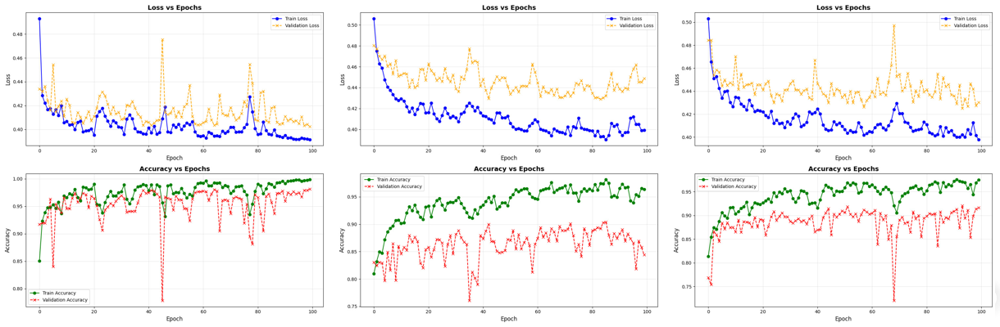

# **AI-Powered Deepfake Detection in Biometric Systems**

## Description
This project focuses on detecting deepfake videos using deep learning techniques, particularly in biometric systems where facial recognition is critical for security. We implemented a solution using the XceptionNet architecture to identify manipulated facial data from real and fake video datasets.

---

## 🧠 Features

### 📁 Datasets Used
- **Celeb-DF-v2**: 42,000+ real and fake facial images.
- **FaceForensics++**: 57,000+ real and fake facial images.
- **Hybrid Dataset**: Combined version for better generalization (99,000+ images).

  
   
  <i>Example training batch combining Celeb-DF-v2 and FaceForensics++</i>

---

### 🔧 Preprocessing
- Face detection and alignment using **Dlib** (68 landmark points).
- Images resized to **128×128 pixels** and converted to tensors.
- Visual difference maps calculated between raw and normalized images.

  
   
  <i>Dlib facial landmark detection example</i>

  
  
   
  <i>Preprocessing: subject face examples with difference maps</i>

---

### 🧱 Model Architecture
- **XceptionNet** with depthwise separable convolutions.
- Optimized using **Binary Cross-Entropy Loss** and **Adam Optimizer**.

  
   
  <i>XceptionNet architectural flow (Entry → Middle → Exit Flow)</i>

---

### 🔍 Feature Extraction

  
  
   
  <i>Feature maps from XceptionNet’s Entry Flow (Layers 1–10)</i>

  
   
  <i>Feature maps from XceptionNet’s Exit Flow (final classification layer)</i>

---

### 🖥️ System Pipeline

  
   
  <i>System architecture overview for end-to-end detection</i>

---

## 📈 Performance Evaluation

### Training Curves

  
   
  <i>Training and validation curves (20 epochs)</i>

  
   
  <i>Training and validation curves (100 epochs)</i>

### Confusion Matrices

  
  
  
   
  <i>Confusion matrices: 20 epochs / 100 epochs / Unseen data</i>

---

### Prediction Examples

  
   
  <i>Predictions on hybrid dataset (100 epochs, seen data)</i>

  
   
  <i>Predictions on hybrid dataset (unseen data)</i>

  
   
  <i>Example batch from unseen test data</i>

---

## ✅ Achievements
- Built a high-performance deepfake detection system using state-of-the-art CNN techniques.
- Successfully evaluated model generalizability with unseen test data.
- Visualized preprocessing and internal feature extraction layers to understand the learning process.

---

## ❗ Challenges
- Ensuring generalization to unseen deepfake manipulations.
- Balancing between accuracy and computational efficiency.
- Limited dataset diversity in real-world-like scenarios.

---

## 🚀 Future Work
- Explore transformer-based and real-time detection architectures.
- Extend dataset diversity through ethical data collection.
- Integrate model into real-time biometric security pipelines.

---

## 📚 References
1. A. Rössler et al., “FaceForensics++,” ICCV, 2019.  
2. Y. Li et al., “Celeb-DF,” CVPR, 2020.  
3. Y. Mirsky and W. Lee, ACM Computing Surveys, 2021.  
4. B. Dolhansky et al., “DFDC Dataset,” 2020.  
5. M. S. Rana et al., IEEE Access, 2022.  
6. B. Zi et al., “WildDeepfake,” ACM Multimedia, 2020.  
7. A. Heidari et al., Wiley Reviews, 2023.  
8. M.-H. Maras and A. Alexandrou, The Int. J. of Evidence & Proof, 2019.  
9. S. Hussain et al., WACV, 2021.  
10. L. Floridi, Philosophy & Technology, 2018.  
